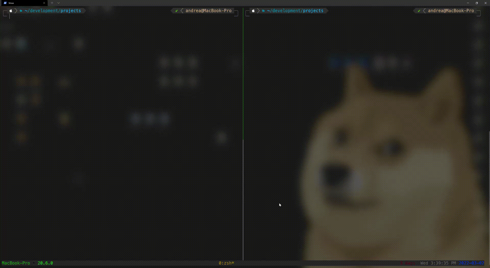

<p align="center">
    
</p>
<h1 align="center">
    MGP
</h1>

A dumb and platform independent command line tool made in Go that performs the equivalent of the following **grep** command, but without taking **ages** to complete.

```sh

grep -E -r -l "mypattern" "/my/path"

```

## Why

I always end up having to search for files containing a simple keyword inside a multitude of directories and subdirectories. Most of the times, grep does its job. Others it takes so long that I end up killing the process.

I made this tool in order to perform the same kind of lookup while taking advantage of **goroutines** in order to parallelize the research in files while the path is being traversed.

Grep still remains the best tool, but for specific needs **MGP** may come handy too.

## How it works

The implementation is based on a recursive traversion that starts from the given base path and excludes sub-trees or files according to their names or, eventually, their size in bytes. Every result from the traversation is then, processed asynchronously in search of a match with a given pattern. 

## Usage

Two parameters are required

- The **pattern** that needs to be matched
- The starting **path** for the recursive research

These can be specified as positional arguments like in grep. Moreover, additional flags can be specified before the pattern and the starting path. These allow to: 

| Flag                       | Action                                                                |
| -------------------------- | --------------------------------------------------------------------- |
| `-exc "path1,path2,path3"` | Exclude specific path or directories                                  |
| `-lim 800`                 | Specify a size limit (in megabytes) in order to exclude big files     |
| `-w 100`                   | Specifiy the maximum number of goroutines that can run simultaneously |
| `-raw`                     | Disable fancy output                                                  |
| `-i`                       | Perform case insensitive matching                                     |
| `-ctx`                     | Print matching lines together with the respective path                |
| `-all`                     | Print all matching lines for each file                                |

### Examples

Here's an example that searches for word "Music" recursiverly starting from the current directory.

```sh
mgp Music . 
```

Case insensitive matches can be enabled using the the `-i` flag.

```sh
mgp -i music . 
```

Here's an example that searches for the word *Panda* recursively starting from the current directory and ignoring directories named *not-me* at any level.

```sh
mgp -exc "not-me" Panda . 
```

Here's, instead, an example that searches for the word *Node* and the word *node* recursively starting from the */home/user/* path and specifically ignoring the */home/user/.local/bin* directory and directories named *.git* at any level.

```sh
mgp -exc ".git,/home/user,local/bin" "[Nn]ode" /home/user/ 
```

<p align="center">
    <h6 align="center">Pretty easy isn't it?</h6>
</p>


## Installation

### Binaries

Precompiled binaries are available in the **Releases** section of this repository. Once downloaded (let's say, for example, I've downloaded the *mgp-v1.1.0-darwin-amd64.tar.gz* archive), one can run

```sh
tar -xzf mgp-v1.0.0-darwin-amd64.tar.gz
```

This will extract the **executable** and a text file containting the **license**. You can, then, place the binary file in your path (or symlink it). Running `mgp` should, then, prompt a message stating the current version.

### Source code

You can also download **MGP** as a Go module. You'll have to install the Go distribution for your system and then run

```sh
go install github.com/canta2899/mgp@latest
```

This will download and compile the program for your platform.


