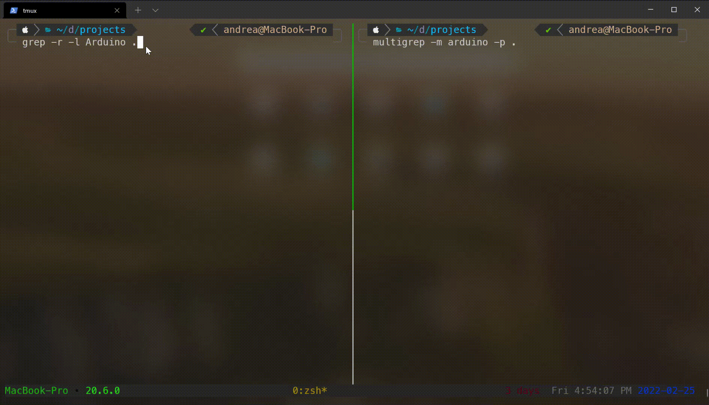

<p align="center">
    
</p>
<h1 align="center">
    Multigrep
</h1>

A dumb and platform independent command line tool made in Go that performs the equivalent of the following **grep** command, but without taking **ages** to complete.

```sh

grep -E -r -l "mypattern" "/my/path"

```

## Why

I always end up having to search for files containing a simple keyword inside a multitude of directories and subdirectories. Most of the times, grep does its job. Others it takes so long that I end up killing the process.

I made this tool in order to perform the same kind of lookup while taking advantage of **goroutines** in order to parallelize the research in files while the path is being traversed.

Grep still remains the best tool, but for specific needs **Multigrep** may come handy too.

## How it works

The implementation follows a simple producer/consumer pattern in which a single goroutine traverses the given directory recursively adding all the valid paths to a queue. Meanwhile, a series of parallel goroutines (whose number is proportional to the amount of logical CPUs available) dequeues each path concurrently and searches for a match between its content and the pattern provided. The queue implementation in based on go's buffered channels.

## Usage

Two parameters are required

- The **pattern** that needs to be matched
- The starting **path** for the recursive research

These can be specified respectively with the `[-m | --match]` and the `[-p | --path]` flags.

An additional parameter allows to **exclude** specific paths or directories from the research. Like in grep, the most common folders (such as .vscode, .git, .idea, etc.) will be excluded by default if no other pattern is specificed.

### Examples

Here's an example that searches for the word *Panda* recursively starting from the current directory and ignoring directories named *not-me* at any level.

```sh
multigrep -m "Panda" -p . -e "not-me"
```

Here's, instead, an example that searches for the word *Node* and the word *node* recursively starting from the */home/user/* path and specifically ignoring the */home/user/.local/bin* directory and directories named *.git* at any level.

```sh
multigrep -m "[Nn]ode" -p /home/user/ -e "/home/user/.local/bin" -e ".git"
```

<p align="center">
    <h6 align="center">Pretty easy isn't it?</h6>
</p>

I highly suggest you to alias multigrep to something like `m` or `mg` in order to access it faster.

### Additional flags

You can **disable the colored output** by adding the `--no-color` flag to the command. Lastly, you can check your current Multigrep version by running `multigrep --version`.

Running `multigrep -h` or `multigrep --help` will prompt a complete usage guide.

## Installation

### Binaries

Precompiled binaries are available in the **Releases** section of this repository. Once downloaded (let's say, for example, I've downloaded the *multigrep-v1.1.0-darwin-amd64.tar.gz* archive), one can run

```sh
tar -xzf multigrep-v1.0.0-darwin-amd64.tar.gz
```

This will extract the **executable** and a text file containting the **license**. You can, then, place the binary file in your path (or symlink it). Running `multigrep --version` should, then, prompt a message stating the current version.

### Source code

You can also download Multigrep as a Go module. You'll have to install the Go distribution for your system and then run

```sh
go install github.com/canta2899/multigrep@latest
```

This will download and compile the program for your platform. Now running `multigrep --version` should prompt you the current version of the program.


